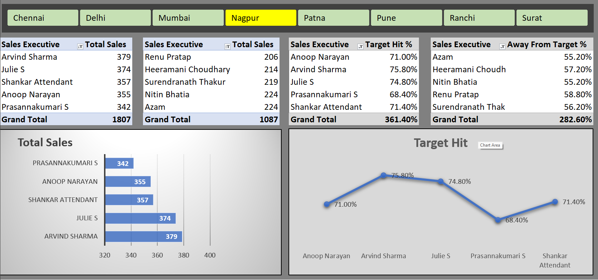

# Excel-Sales-Dashboard-
# 📊 Sales Performance Dashboard (Excel)

## 📌 Overview

An interactive Sales Performance Dashboard built in Microsoft Excel to analyze sales performance across multiple cities and sales executives. The dashboard helps track sales achievements, target completion, and performance gaps through dynamic visualizations and filters.

---

## 🚀 Dashboard Features

✅ City-wise Interactive Filtering

✅ Sales Executive Performance Analysis

✅ Total Sales Tracking

✅ Target Hit % Analysis

✅ Away From Target % Analysis

✅ Dynamic Pivot Tables

✅ Interactive Charts & Visualizations

✅ Executive Ranking Based on Sales Performance

---

## 🛠️ Tools & Techniques Used

- 📗 Microsoft Excel
- 📈 Pivot Tables
- 📊 Pivot Charts
- 🎛️ Slicers
- 🧹 Data Cleaning
- 🎨 Conditional Formatting
- 📋 Dashboard Design

---

## 📍 Key Metrics

### 💰 Total Sales
Displays total sales generated by each sales executive.

### 🎯 Target Hit %
Shows the percentage of assigned targets achieved by executives.

### ⚠️ Away From Target %
Highlights the gap between actual sales and assigned targets.

### 🏙️ City-wise Analysis
Analyze sales performance across different cities:

- Chennai
- Delhi
- Mumbai
- Nagpur
- Patna
- Pune
- Ranchi
- Surat

---

## 📸 Dashboard Preview



---

## 📈 Business Insights

🔹 Identify top-performing sales executives

🔹 Track underperforming employees

🔹 Compare sales performance across cities

🔹 Measure target achievement rates

🔹 Monitor performance gaps for better decision-making

---

## 📂 Project Structure

```text
Sales-Performance-Dashboard/
│
├── Sales_Performance_Dashboard.xlsx
├── Dashboard.png
└── README.md
```

---

## 🎓 Skills Demonstrated

- Data Analysis
- Dashboard Development
- Data Visualization
- Business Reporting
- Performance Analysis
- Excel Automation

---

## 👨‍💻 Author

**Vishal Bundela**

🔗 GitHub: https://github.com/vishalbundela

📧 Add Your Email Here

💼 Add Your LinkedIn Profile Here

---

⭐ If you found this project useful, don't forget to give it a star!
